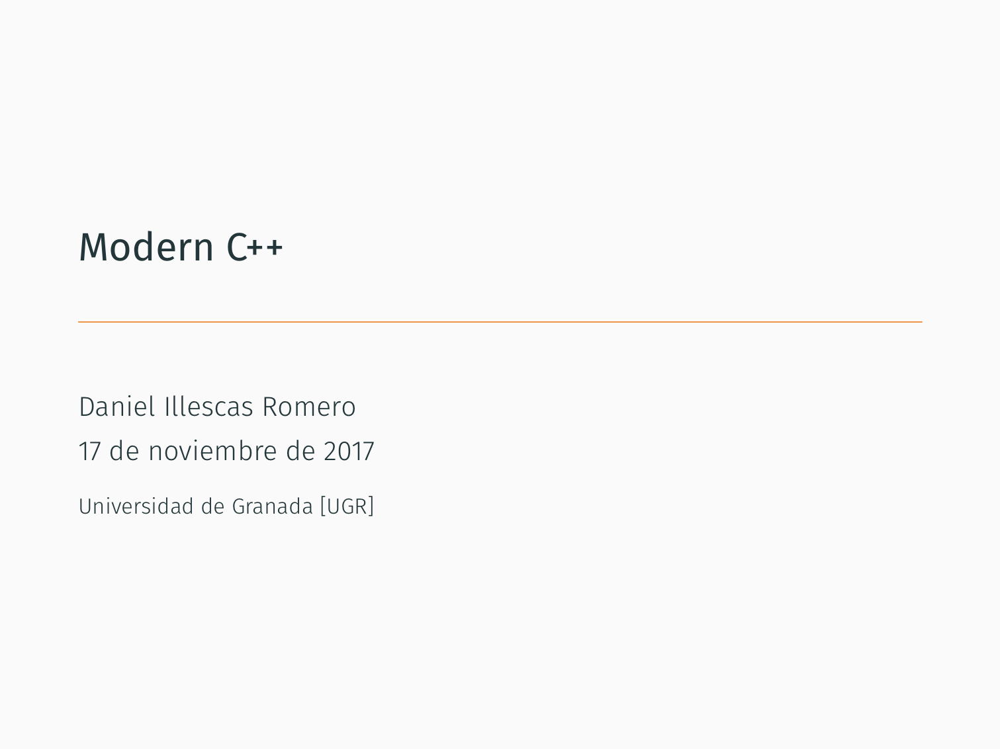
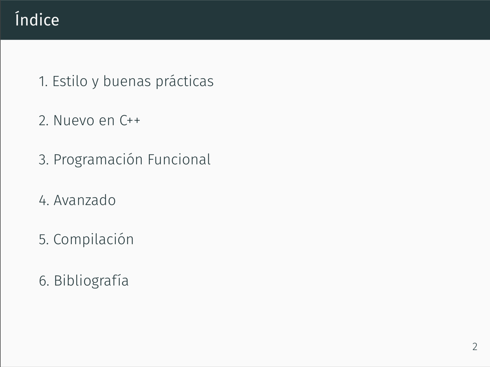
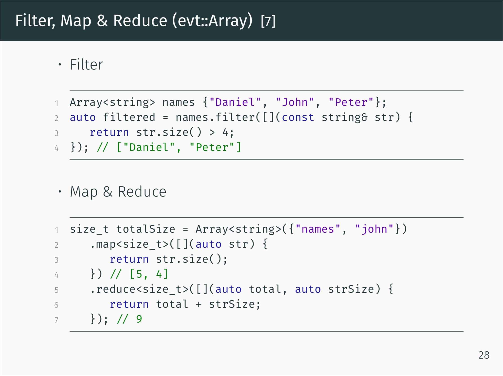

# Modern-Cpp-Spanish

Presentación para la UGR sobre buenas prácticas y nuevas funciones de C++.

# Vista previa

# Licencia

Cualquier persona tiene permiso de decargase la presentación, modificarla, redistribuirla, etc. El único requisito es incluir el fichero de licencia (LICENSE) o la cabecera. (Más info: https://github.com/illescasDaniel/Modern-Cpp-Spanish/blob/master/LICENSE)